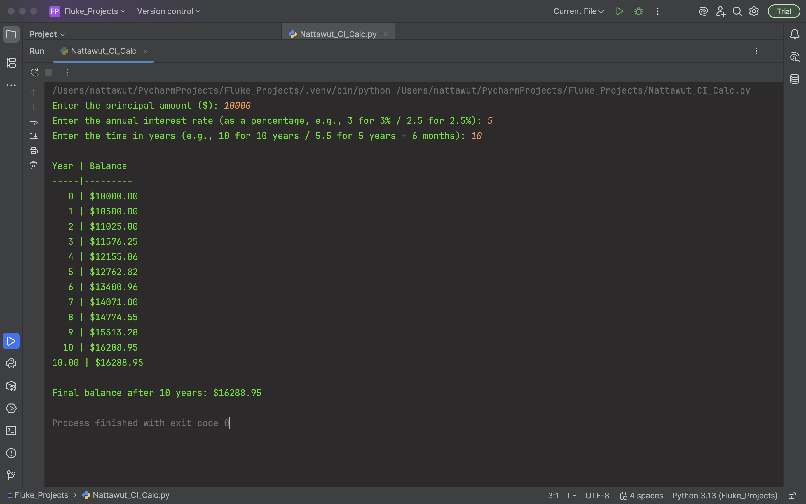

# Compound Interest Calculator by Nattawut Boonnoon
*Update 2025: repo_404s_error & LICENSE fixed.*

A beginner-friendly project inspired by Benjamin Graham, the father of value investing, and calculated by the standard compound interest formula: **A = P(1 + r/n)^(nt)**

A: is the future value of the investment/loan, including interest.

P: is the principal amount, the initial sum of money.

r: is the annual interest rate (as a decimal).

n: is the number of times that interest is compounded per year.

t: is the number of years the money is invested or borrowed for.

A Python tool that displays year-by-year growth in a table and computes compound interest with decimal years.

## How to Run
1. Install Python.
2. Download 'Nattawut_CI.py'
3. Run the code.
4. Enter your principal, interest rate, and time in years.
5. Enjoy

*** If you can't find my Python file, clear your browser cache or try on incognito mode ***

## Credits

Built By Nattawut Boonnoon 770.

This project is part of the Python Programming course at Srinakharinwirot University.

Created on October 30, 2022.

LinkedIn: www.linkedin.com/in/nattawut-bn
